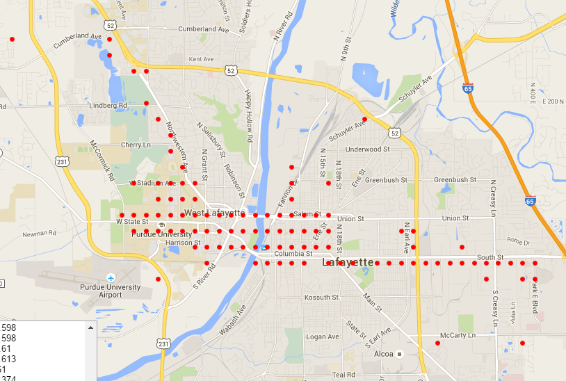
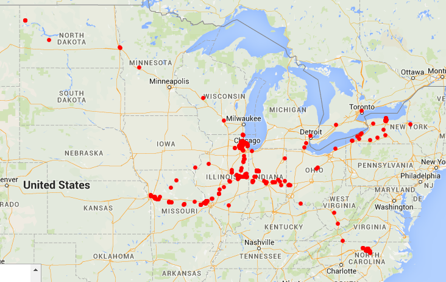

Locator
=========

The locator network attempts to learn from a user's location history.

The biggest difficulty is getting the location latitude and longitude into a format that is readily learnable by whatever learners.

This was solved by creating a sparse virtual grid over the entire globe, and nodes are created ONLY if the user have >= 10 GPS coordinates within a grid point. My own GPS data from 3 years of life (which includes several trips across country, and 4 places of residence) ended up being about 670 nodes - which is less than even an MNIST digit. The grid points are created on-call, and exist forever from creation. The minimum size of datapoint allows there to be a minimal number of samples from which to learn from each grid point. Since the grid location is in a one-of-entire-globe encoding, each location ends up being just the index of the node for the user.

So my current apartment would be (for example) node 543 active and all 670 others off.

The entire US map looks as follows:

Many of those points are irrelevant, so at some point a "node-pruning" algorithm would also become handy, but as it stands, with only 670 nodes for 3 years, the extra nodes are not going to matter much.
